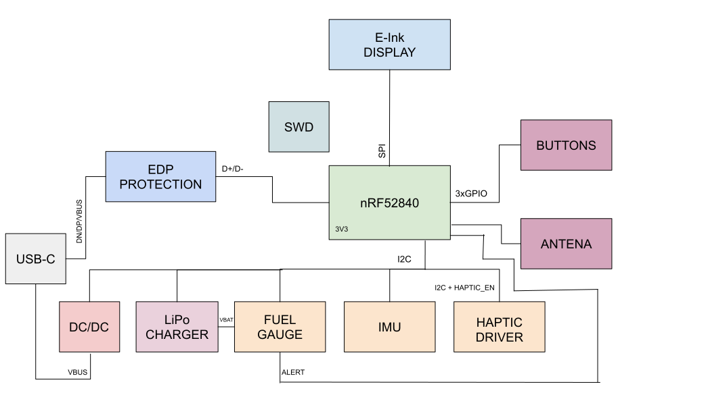

# Proiect_TSC

## BOM(Bill of Materials)
| Componentă | Producator | Cantitate | Link achizitie | Datasheet |
| :--- | :--- | :---: | :--- | :--- |
| **nRF52840** | Nordic Semiconductor | 1 | [Link](https://jlcpcb.com/partdetail/NordicSemicon-NRF52840_QFAA_FR/C3606918) | [Datasheet](https://infocenter.nordicsemi.com/pdf/nRF52840_PS_v1.1.pdf) |
| **BMA423** | Bosch | 1 | [Link](https://jlcpcb.com/partdetail/BoschSensortec-BMA423/C189517) | [Datasheet](https://www.bosch-sensortec.com/media/boschsensortec/downloads/datasheets/bst-bma423-ds004.pdf) |
| **BQ25180YBGR** | Texas Instruments | 1 | [Link](https://jlcpcb.com/partdetail/TexasInstruments-BQ25180YBGR/C3682423) | [Datasheet](https://www.ti.com/lit/ds/symlink/bq25180.pdf) |
| **MAX17048G+T10** | Analog Devices | 1 | [Link](https://jlcpcb.com/partdetail/2777647-MAX17048GT10/C2682616) | [Datasheet](https://datasheets.maximintegrated.com/en/ds/MAX17048-MAX17049.pdf) |
| **DRV2605YZFR** | Texas Instruments | 1 | [Link](https://jlcpcb.com/partdetail/TexasInstruments-DRV2605YZFR/C81079) | [Datasheet](https://www.ti.com/lit/ds/symlink/drv2605.pdf) |
| **RT6160AWSC** | Richtek | 1 | [Link](https://jlcpcb.com/partdetail/RichtekTech-RT6160AWSC/C7065276) | [Datasheet](https://www.richtek.com/assets/product_file/RT6160/DS6160-03.pdf) |
| **2450AT18B100E** | Johanson | 1 | [Link](https://jlcpcb.com/partdetail/JohansonDielectrics-2450AT18B100E/C2917717) | [Datasheet](https://www.johansontechnology.com/datasheets/2450AT18B100E/2450AT18B100E.pdf) |
| **744043680 (L4)** | Wurth | 1 | [Link](https://jlcpcb.com/partdetail/WurthElektronik-744043680/C2045671) | [Datasheet](https://www.we-online.com/catalog/datasheet/744043680.pdf) |
| **FTC252012SR47** | CMT | 1 | [Link](https://jlcpcb.com/partdetail/6763488-FTC252012SR47MBCA/C5832368) | [Datasheet](https://product.tdk.com/en/system/files/dam/doc/product/inductor/inductor/smd/catalog/inductor_commercial_power_ftc252012s_en.pdf) |
| **503480-2400** | Molex | 1 | [Link](https://jlcpcb.com/partdetail/MOLEX-5034802400/C122434) | [Datasheet](https://www.molex.com/pdm_docs/sd/5034802400_sd.pdf) |
| **USB-C 16P** | Kinghelm | 1 | [Link](https://jlcpcb.com/partdetail/Shenzhen_KinghelmElec-KH_TYPE_C16P/C709357) | [Datasheet](https://datasheet.lcsc.com/lcsc/2112151030_Kinghelm-KH-TYPE-C-16P_C2930266.pdf) |
| **EVP-AKE31A** | Panasonic | 3 | [Link](https://jlcpcb.com/partdetail/PANASONIC-EVPAKE31A/C569760) | [Datasheet](https://industrial.panasonic.com/ww/products/pt/tactile-sw/models/EVPAKE31A) |
| **USBLC6-2SC6Y** | STMicroelectronics | 1 | [Link](https://jlcpcb.com/partdetail/STMicroelectronics-USBLC62SC6Y/C2969755) | [Datasheet](https://www.st.com/resource/en/datasheet/usblc6-2.pdf) |
| **MBR0530** | JCET | 3 | [Link](https://jlcpcb.com/partdetail/78464-MBR0530/C77336) | [Datasheet](https://www.onsemi.com/pdf/datasheet/mbr0530t1-d.pdf) |
| **SI1308EDL** | Vishay | 1 | [Link](https://jlcpcb.com/partdetail/VishayIntertech-SI1308EDL_T1GE3/C469327) | [Datasheet](https://www.vishay.com/docs/72013/si1308edl.pdf) |
| **DMG2305UX-7** | TECH PUBLIC | 1 | [Link](https://jlcpcb.com/partdetail/TECHPUBLIC-DMG2305UX/C2940629) | [Datasheet](https://www.diodes.com/assets/Datasheets/DMG2305UX.pdf) |
| **GRM0335C1E101JA01D** | Murata Electronics | 10 | [Link](https://jlcpcb.com/partdetail/MurataElectronics-GRM0335C1E101JA01D/C76917) | [Datasheet](https://docs.rs-online.com/3c16/A700000008615521.pdf) |
| **Condensatoare(0402)** | Samsung Electro-Mechanics | 21 | [Link](https://jlcpcb.com/partdetail/Samsung_Electro_Mechanics-CL05A105KB5NQNC/C52923) | [Datasheet](https://www1.futureelectronics.com/doc/Samsung%20Electro-Mechanics/CL05A105KA5NQNC-SMP.pdf) |
| **Condensatoare(0201)** | Samsung Electro-Mechanics | 17 | [Link](https://jlcpcb.com/partdetail/Murata_Electronics-GRM033R61A104KE84D/C1619) | [Datasheet](https://docs.rs-online.com/3c16/A700000008615521.pdf) |
| **Rezistente(0201)** | UNI-ROYAL | 17 | [Link](https://jlcpcb.com/parts/componentSearch?searchTxt=0201%20resistor) | [Datasheet](https://jlcpcb.com/api/file/downloadByFileSystemAccessId/8590910972175327232) |

## Functionalitati hardware

### LiPo Charger
Circuitul incarca o baterie LiPo (Lithium-Polymer), controland tensiunea si curentul pentru a preveni supraincarcarea, deteriorarea sau riscul de incendiu. Comunica folosind I2C cu nRF52840.

### Fuel Gauge
Circuitul masoara nivelului bateriei. El alerteaza ceasul cand nivelul bateriei este scazut. Comunica folosind I2C cu nRF52840.

### DC/DC
Circuitul alimenteaza si transforma tensiunea in alte tensiuni stabile, necesare pentru alte componente ale ceasului. Comunica folosind 
I2C cu nRF52840.

### E-Paper Connector
Circuitul este conexiunea la ecranul E-Paper. Comunica folosind SPI cu nRF52840.

### E-Paper Drive Circuit
Circuit de comanda care genereaza si controleaza tensiunile si semnalele necesare pentru a actualiza un afisaj E-Paper. Gestioneaza
procesul de schimbare al pixelilor pentru a afisaj.

### USB-C Connector
Circuitul reprezintă mufa USB. Asigura alimentare, transfer de date si semnal video între dispozitive.

### ESD Protection
Circuitul protejează electronica sensibila din USB impotriva descarcarilor electrostatice bruste, limitand tensiunile mari și devierea
curentului către masa pentru a preveni deteriorarea componentelor.

### SWD
Circuitul este folosit pentru debugging. Poate fi conectat la JTAG.

### Haptic Driver
Circuitul genereaza vibratii, transformand semnale digitale din microcontroler in impulsuri precise de vibratie. Comunica folosind I2C cu 
nRF52840.

### IMU
Circuitul masoara acceleratia si directia ceasului. Comunica folosind I2C cu nRF52840.

## nRF52840 - descrierea pinilor
* **P$AD12 (EPD_BUSY)** - conexiune care arata daca ecranul este ocupat (E-Paper Display)
* **P$AD10 (EPD_DC)** - conexiune data/command(E-Paper Display)
* **P$K2 (EPD_CS)** - conexiune chip select(E-Paper Display)
* **P$AD12 (EPD_RST)** - conexiune pentru resetare(E-Paper Display)
* **P$A12 (SCK)** - clock SPI(E-Paper Display)
* **P$P13 (MOSI)** - data(master out slave in) SPI(E-Paper Display).
* **P$Y23 (P1.01)** - conexiune circuit de comanda
* **P$AD8 (P0.13)** - buton din stanga
* **P$AC9 (P0.14)** - buton din mijloc
* **P$W24 (P1.02)** - buton din dreapta
* **P$AD6 (D+)** - traseu diferențial pozitiv pentru ESD Protection
* **P$AD4 (D-)** - traseu diferențial negativ pentru ESD Protection.
* **P$AD2 (VBUS)** - conexiune VBUS(USB)
* **P$U1 (HAPTIC_EN)** - conexiune enable/disable(Haptic Driver)
* **P$T2 (PMIC_INT)** - intrerupere(LiPo Battery)
* **P$P2 (IMU_INT2)** - intrerupere(IMU)
* **P$N1 (IMU_INT1)** - intrerupere(IMU)
* **P$M2 (SCL)** - clock I2C
* **P$L1 (SDA)** - data I2C
* **P$J24 (ALERT)** - conexiune cu alerta(Fuel Gauge)
* **P$AD22 (SWO)** - conexiune pentru debug(TP_SWO)
* **P$AC13 (RESET)** - conexiune pentru resetarea componentei(TP_RESET, SWD)
* **P$AA24 (SWDCLK)** - conexiune pentru debug(SWD)
* **P$AC24 (SWDIO)** - conexiune input/output(SWD)
* **P$F2 și P$D2** - ceasul de 32 kHz
* **P$A23 și P$A24** - ceasul de 32 MHz
* **P$H23, P$F23** - conexiune antena antenă.

## Rutare

Cablajul imprimat (PCB) este realizat pe **4 straturi (4-layer stack-up)**:
* **Top** – rutarea semnalelor si plasarea componentelor
* **GND** – plan de masa continuu (GND)
* **Power** – plan de alimentare
* **Bottom** – rutarea semnalelor

**DC/DC**, **LiPo Charger** si **Fuel Gauge** le-am pozitionat apropiate pentru a oferi un transfer transfer de putere cat mai eficient.
**E-Paper Drive Circuit** a fost izolat in partea de stanga sus(dar tot aproape de **E-Paper Display Connector**) pentru a evita zgomotele
care ar putea fi produse de bobina si care ar putea afecta semnalel SPI, busy sau reset din **E-Paper Display Connector**.
**Haptic Driver** este tinut la distanta de IMU pentru a preveni interferentele din cauza vibratiilor.

## Erori

### via-smd
Am acceptat erorile astea pentru a majoritatea provin din faptul ca am facut vi-in-pad pentru GND.

### smd-via
Le-am acceptat pentru ca fie vin din acelasi motiv ca erorile de mai sus fie de la nRF52840 pentru ca a trebuit
sa pun via-in-pad pentru a conecta cu intrarile de mai din interior.

### solid-poligon-shape
Sunt erori de la butoane. Cred ca este de la disignul lor si nu le pot rezolva.

### via-via
Acestea provin tot de la nRF52840, tot pe intrarile de mai din interior. Le-am acceptat pentru ca altfel nu puteam
conecta firele pentru ca spatiul era mult prea mic.

### via, drill size
Tot ca mai sus. Am fost nevoit sa folosesc via pentru a conecta firele. Spatiul fiid prea mic a trabuit sa
folosesc drill size mai mic de 0.3mm cum precizeaza rule-urile.

### smd-hole
Problema vine de la USB. Tot designul este prblema. Nu am stiut cum sa rezolv aceasta problema fara sa modific
efectiv designul componentei.

### air-wire
Am ales sa ignor acesta eroare ca sa nu trag via-uri perin nRF52840 sau sa trag fire pe sub el.
